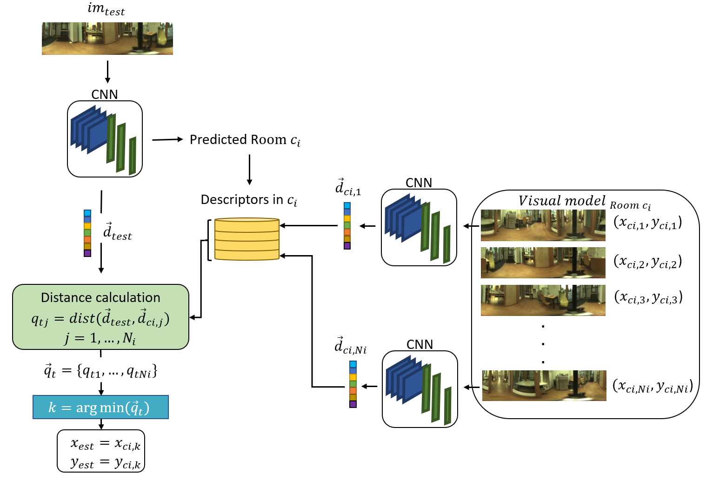

# An Evaluation of CNN Models and Data Augmentation Techniques in Hierarchical Localization of Mobile Robots

**Authors:** J.J. Cabrera, O.J. Céspedes, S. Cebollada, O. Reinoso, L. Payá  
**Journal:** Evolving Systems (2024)  
**Publisher:** Springer-Verlag  
**ISSN:** 1868-6486  
**DOI:** [10.1007/s12530-024-09604-6](https://doi.org/10.1007/s12530-024-09604-6)  
**arXiv:** [2407.10596](https://arxiv.org/abs/2407.10596)

## Introduction

This work presents an evaluation of CNN models and data augmentation techniques to carry out the hierarchical localization of a mobile robot using omnidirectional images. An ablation study of different state-of-the-art CNN models used as the backbone is presented, and a variety of data augmentation visual effects are proposed to address the visual localization of the robot. The proposed method is based on adapting and retraining a CNN with a dual purpose: 
1. To perform a rough localization step where the model predicts the room from which an image was captured.
2. To address the fine localization step by retrieving the most similar image from the visual map among those in the previously predicted room through a pairwise comparison between descriptors obtained from an intermediate layer of the CNN.

We evaluate the impact of different state-of-the-art CNN models such as ConvNeXt for the proposed localization. Various data augmentation visual effects are separately employed for training the model, and their impact is assessed. The performance of the resulting CNNs is evaluated under real operation conditions, including changes in lighting conditions.

## Repository Structure

The repository is structured as follows:

    ├── config
    │ ├── config.pu
    │ ├── parameters.yaml
    ├── eval
    │ ├── evaluate.py
    │ ├── evaluation_utils.py
    │ ├── save_all_test_errors.py
    │ ├── validation.py
    ├── train
    │ ├── run_train.py
    │ ├── training_module.py
    ├── README.md
    ├── datasets.py 
    ├── models.py
    ├── requirements.txt
    └── LICENSE

## Comparison with Other Methods

| Model                             | Cloudy Error | Night Error | Sunny Error |
|-----------------------------------|--------------|-------------|-------------|
| Alexnet + DA [1] | 0.29 m       | 0.29 m      | 0.69 m      |
| EfficientNet [2] | 0.24 m       | 0.33 m      | 0.44 m      |
| Triplet VGG16 [3]    | 0.25 m       | 0.28 m      | **0.40 m**  |
| ConvNeXt Large (ours)             | **0.22 m**   | **0.26 m**  | 0.83 m      |
| ConvNeXt Large + DA (ours)        | **0.22 m**   | 0.27 m      | 0.57 m      |
| HOG [4]           | -            | 0.45 m      | 0.82 m      |
| gist [4]          | -            | 1.07 m      | 0.88 m      |

[1] Cabrera, J.J., Cebollada, S., Flores, M., Reinoso, O., Payá, L.: Training, optimiza-
tion and validation of a cnn for room retrieval and description of omnidirectional
images. SN Computer Science 3(4), 1–13 (2022)

[2] Rostkowska, M. and P. Skrzypczy´nski. 2023. Optimizing appearance-based
localization with catadioptric cameras: Small-footprint models for real-time
inference on edge devices. Sensors 23 (14): 6485 

[3] Alfaro, M., Cabrera, J.J., Jiménez, L.M., Reinoso, Payá, L.: Hierarchical local-
ization with panoramic views and triplet loss functions (2024)

[4] Cebollada, S., L. Payá, X. Jiang, and O. Reinoso. 2022. Development and
use of a convolutional neural network for hierarchical appearance-based
localization. Artificial Intelligence Review 55 (4): 2847–2874 

## Citation
If you find this work useful, please consider citing:

    @article{Cabrera2024CNNLocalization,
    title={An evaluation of CNN models and data augmentation techniques in hierarchical localization of mobile robots},
    author={J.J. Cabrera and O.J. Céspedes and S. Cebollada and O. Reinoso and L. Payá},
    journal={Evolving Systems},
    year={2024},
    publisher={Springer-Verlag},
    issn={1868-6486},
    doi={10.1007/s12530-024-09604-6}
    }
